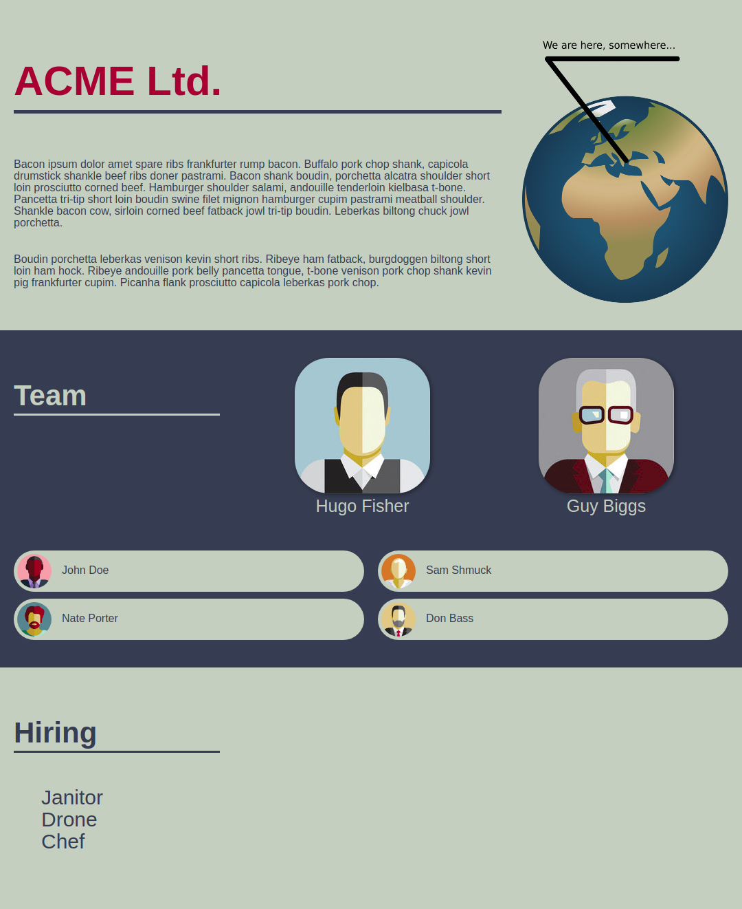

# ACME Ltd. Company Website

Following an excruciating decade of operations, our company "ACME Ltd." finally broke even and can pay its employees their first salary. There's even 16 bucks leftover to spend on marketing and brand recognition. You've been chosen to carry out the noble task of building a glorious company website that will elevate our business to new heights!

Our fate rests upon you brave coder, as you are the only person in the world able to fulfill this mission!


## Requirements
The website should consist of "About", "Team", and "Open positions" sections all presented on a single page.

### Design
This is the full color scheme used throughout the design:

- `#C8CEC2` Light laurel
- `#323D4F` Dark denim blue
- `#A02534` Accent red

You can find all necessary images within the `assets/` folder, all text and implementation instructions can be found in the following sections, and size guidelines can be found [here](sizing.png).



### About section
The first (landing) section should feature the company's name, a few paragraphs of text (we really like [bacon](https://baconipsum.com/?paras=2&type=all-meat&start-with-lorem=1)), and a very specific [map to our office location](assets/globe.png).

### Team section
The team section should list all employees currently working in the company, showing their photo and name alongside. All managerial staff should be prominently displayed above everybody else.

Also, for some reason employees quit all the time - so have in mind we will need to frequently add, remove or swap out people in any of the positions.

The current list of employees is as follows (their photos can be found in the `assets/` folder mentioned in the design section):

Managers:

- Hugo Fisher
- Guy Biggs

Others:

- John Doe
- Nate Porter
- Sam Shmuck
- Don Bass

### Open positions section
The last section should simply list all open positions in the company. As we mentioned above, people come and go often so we'll need to update this list frequently as well.

We are currently looking for a:

- Janitor
- Chef
- CEO
- Demolition expert
- Babysitter


## Technical requirements

All static files and API call should be served from a single running node instance.

### Front-end
The front-end should be written using HTML, CSS, and JavaScript, leveraging the React library, and should run properly on all major browsers. It must dynamically fetch and render employee and job opening data from the back-end API.

### Back-end
The back-end should be written using JavaScript, leveraging the Express library, and should run properly on Node.js version 8 and above.

It should serve both the API endpoints and all incoming static file requests.

The following endpoints and their corresponding JSON response schema must be implemented (all data should be mocked - i.e no database is used):

#### `/api/employees`
```json
[
    {
        "id": 1,
        "name": "Full Name",
        "picture": "/image.jpg",
        "big": false
    },
    {
        "id": 2,
        "name": "Full Name",
        "picture": "/image.jpg",
        "big": false
    },
    ...
]
```

#### `/api/openings`
```json
[
    {
        "id": 1,
        "title": "Job Title"
    },
    {
        "id": 2,
        "name": "Job Title"
    },
    ...
]
```

